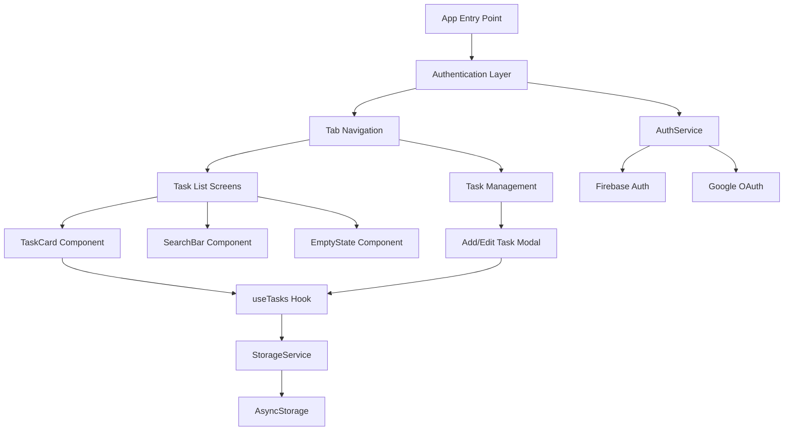

## Todo Task Management App ##

A cross-platform mobile todo application built with React Native (Expo) featuring Google authentication, offline support, and comprehensive task management capabilities.

**Note**: This project is a part of a hackathon run by https://www.katomaran.com

## Features

### Authentication
- Google Sign-In integration using Firebase Auth
- Secure user session management
- Error handling with user-friendly messages

### Task Management (CRUD)
- Create, Read, Update, Delete tasks
- Task fields: title, description, due date, status, priority
- Mark tasks as completed/incomplete
- Priority levels: Low, Medium, High

### User Interface & UX
- Clean, modern Material Design inspired UI
- Tab-based navigation (All Tasks, Active, Completed)
- Search functionality by title or description
- Empty state placeholders
- Floating Action Button for quick task creation
- Smooth animations and micro-interactions

### Offline Support
- Local storage using AsyncStorage
- Data persistence across app sessions
- Works seamlessly without internet connection

### Additional Features
- Pull-to-refresh functionality
- Swipe-to-delete tasks
- Task filtering and search
- Responsive design for all screen sizes
- Modern typography with Inter font family

## Architecture
The app follows a clean, modular architecture with clear separation of concerns:
```
├── app/                    # Expo Router pages
│   ├── (tabs)/            # Tab navigation screens
│   ├── auth.tsx           # Authentication screen
│   ├── add-task.tsx       # Task creation/editing modal
│   └── _layout.tsx        # Root layout
├── components/            # Reusable UI components
├── hooks/                 # Custom React hooks
├── services/              # Business logic and API services
├── types/                 # TypeScript type definitions
└── README.md
```

### Key Design Patterns
- **Custom Hooks**: `useTasks`, `useAuth` for state management
- **Service Layer**: Separate services for authentication and storage
- **Component-based Architecture**: Modular, reusable components
- **TypeScript**: Full type safety throughout the application

## Setup Instructions

### Prerequisites
- Node.js (v16 or higher)
- npm or yarn
- Expo CLI: `npm install -g @expo/cli`
- Expo Go app on your mobile device (for testing)

### Installation

1. **Clone the repository**
   bash
   cd todo-task-management-app

2. **Install dependencies**
   bash
   npm install

3. **Configure Firebase (Optional)**
   - Create a Firebase project at https://console.firebase.google.com
   - Enable Google Authentication
   - Update the Firebase configuration in `services/auth.ts`
   - Add your Google OAuth client ID

4. **Start the development server**
   bash
   npm run dev

5. **Run on device/emulator**
   - Scan the QR code with Expo Go app (iOS/Android)
   - Or press 'w' to open in web browser

### Building for Production

1. **Build for web**
   bash
   npm run build:web

2. **Create development build**
   bash
   eas build --profile development --platform all

3. **Create production build**
   bash
   eas build --profile production --platform all

## Technology Stack

- **Framework**: React Native with Expo SDK 52
- **Navigation**: Expo Router with tab-based navigation
- **Authentication**: Firebase Auth with Google Sign-In
- **Storage**: AsyncStorage for offline data persistence
- **Styling**: StyleSheet API with custom design system
- **Icons**: Lucide React Native
- **Typography**: Inter font family via Expo Google Fonts
- **State Management**: React hooks with custom hook abstractions
- **TypeScript**: Full type safety and IntelliSense support

## Assumptions Made

1. **Authentication**: Google Sign-In is the primary authentication method
2. **Offline-First**: App should work seamlessly without internet connection
3. **Data Persistence**: Tasks are stored locally using AsyncStorage
4. **Platform**: Designed primarily for mobile devices with web compatibility
5. **Date Handling**: Due dates are stored in ISO format for consistency
6. **User Experience**: Emphasis on smooth animations and intuitive interactions

   ## Architecture Diagram



